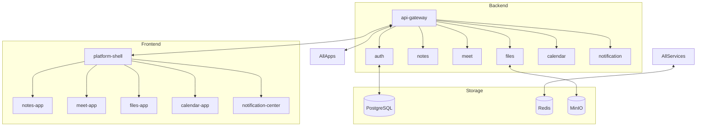

# MVP Suite – Comprehensive Final Implementation Plan

## 1. Objectives

- Build a modular, scalable productivity platform with microapps: Notes, Meet, Files, Calendar, Notification Center.
- Focus on essential MVP features for each app, maximizing clarity and usability.
- Apply microservices design patterns (microservices.io, Martin Fowler) in real-world scenarios.
- Ensure maintainability, resiliency, fault tolerance, and extensibility.

## 2. Architecture Overview

### System Components

- **Frontend:** Angular microfrontends (Module Federation), Nx monorepo.
- **Backend:** NestJS microservices, API Gateway, Redis, PostgreSQL, MinIO.
- **Shared Libraries:** Auth, UI, Types, Presence, CRDT Core.
- **Infrastructure:** Docker, CI/CD (GitHub Actions), Monitoring (Prometheus, Grafana), ELK stack.

### Component Interactions

- API Gateway routes REST/WebSocket traffic, handles authentication and rate limiting.
- Microservices communicate via event-driven pub/sub (Redis, upgradeable to NATS).
- Each service manages its own database schema (Database per Service).
- Frontend apps interact with backend via REST/WebSocket.

### Design Patterns Applied

- **API Gateway:** Centralized routing, aggregation, security.
- **Database per Service:** Autonomy, scalability.
- **Event-Driven Architecture:** Pub/sub for notifications, sync.
- **Saga:** Distributed transactions for workflows (e.g., file upload).
- **Circuit Breaker:** Resilience against service failures.
- **CQRS:** Separate read/write models for Notes, Calendar.
- **Bulkhead:** Resource isolation per service.
- **Service Discovery:** Static registry, upgradeable to dynamic.

## 3. Microapp MVP Breakdown

### Notes App

- Real-time collaborative markdown editing (WebSocket, CRDT/OT).
- Presence: show online users.
- Minimal Text only formatting.

### Meet App

- One-on-one video call (WebRTC).
- Custom signaling server (WebSocket).

### Files App

- Drag-and-drop upload.
- File listing with metadata.
- Download via presigned URL.

### Calendar App

- Event creation and listing.
- Conflict detection (no overlaps).

### Notification Center

- Real-time push notifications (WebSocket).
- Notification inbox.

## 4. Data Flow & Interactions

- REST for CRUD, WebSocket for real-time sync.
- JWT authentication, RBAC for route protection.
- Event-driven updates for notifications and presence.
- Each service interacts with its own DB and Redis.

## 5. UI Design

- Simple, clean layouts using Angular Material/Tailwind.
- Only essential UI elements per app.
- Accessibility and usability prioritized.

## 6. Error Handling

- Frontend: user-friendly error messages, retry for transient failures.
- Gateway: centralized error handling, logging, rate limiting.
- Services: exception filters, validation, structured logging.
- Storage: transactional operations, backup/restore.

## 7. Testing Strategies

- Unit tests for core logic (Jest).
- Integration tests for API/service interactions.
- E2E tests for main user flows (Cypress/Playwright).
- WebSocket/REST mocking for real-time scenarios.
- Coverage enforced in CI.

## 8. Deployment & Maintenance

- CI/CD: automated build, test, deploy (GitHub Actions).
- Docker: containerize all apps/services.
- Kubernetes: optional for orchestration and scaling.
- Monitoring: Prometheus, Grafana, ELK stack.
- Documentation: architecture, onboarding, API contracts.

## 9. Step-by-Step Procedures

### Nx Monorepo Setup

1. Initialize Nx workspace with Angular + NestJS plugins.
2. Scaffold `/apps/platform-shell`, `/apps/notes-app`, `/apps/meet-app`, `/apps/files-app`, `/apps/calendar-app`, `/apps/notification-center`, `/apps/api-gateway`.
3. Create `/libs/shared-ui`, `/libs/auth`, `/libs/types`, `/libs/presence`, `/libs/crdt-core`.
4. Scaffold `/services/auth`, `/services/notes`, `/services/meet`, `/services/files`, `/services/calendar`, `/services/notification`.

### API Gateway

1. Implement routing, rate limiting, versioning.
2. Secure endpoints with JWT, RBAC.
3. Integrate REST and WebSocket gateways.

### Microservices

1. Define domain models and database schemas.
2. Implement CRUD endpoints, event emitters.
3. Integrate Redis for pub-sub and presence.
4. Add health checks and metrics endpoints.

### Frontend Microapps

1. Implement authentication and route guards.
2. Integrate shared UI components.
3. Build microapp UIs with real-time features.
4. Connect to backend via REST/WebSocket.

### Real-Time Communication

1. Build custom CRDT/OT engine for notes.
2. Implement WebSocket gateways for sync and signaling.
3. Design presence and notification flows.

### File Storage

1. Integrate MinIO/local storage abstraction.
2. Implement presigned URL generation.
3. Secure uploads/downloads.

### Calendar & Notification

1. Event creation, conflict detection, timezone logic.
2. Real-time notification delivery and inbox.

### Authentication

1. JWT access/refresh tokens, RBAC.
2. Shared auth lib for frontend/backend.
3. Optional OAuth integration.

### CI/CD & Deployment

1. Configure GitHub Actions for build/test/deploy.
2. Write Dockerfiles for all components.
3. Plan Kubernetes manifests for scaling.
4. Set up monitoring, alerting, and backup.

### Testing & Quality

1. Write unit/integration/E2E tests.
2. Enforce coverage and code quality in CI.
3. Peer review and documentation standards.

## 10. Real-World Scenarios & Pattern Experience

- Notes: Event-driven sync, CQRS, circuit breaker for DB failures.
- Meet: API Gateway for signaling, bulkhead for video streams.
- Files: Saga for upload workflow, database per service.
- Calendar: CQRS for event queries, event-driven notifications.
- Notification: Pub/sub for delivery, circuit breaker for push failures.

## 11. Best Practices

- Independent deployability, automated testing, monitoring, and documentation.
- Loose coupling, high cohesion, resilience.
- Containerization and CI/CD for repeatable deployments.
- Simulate failure scenarios for learning.

## 12. Success Metrics

- >1M concurrent users, <200ms latency.
- 99.99% uptime, 90%+ test coverage.
- Automated CI/CD, zero critical vulnerabilities.
- Positive onboarding feedback.

## 13. Deliverables

- Nx monorepo with all apps/services/libs.
- Automated test suites, CI/CD pipelines.
- Docker/Kubernetes manifests.
- Monitoring dashboards.
- Comprehensive documentation.

## 14. Architecture Diagram (Mermaid)

